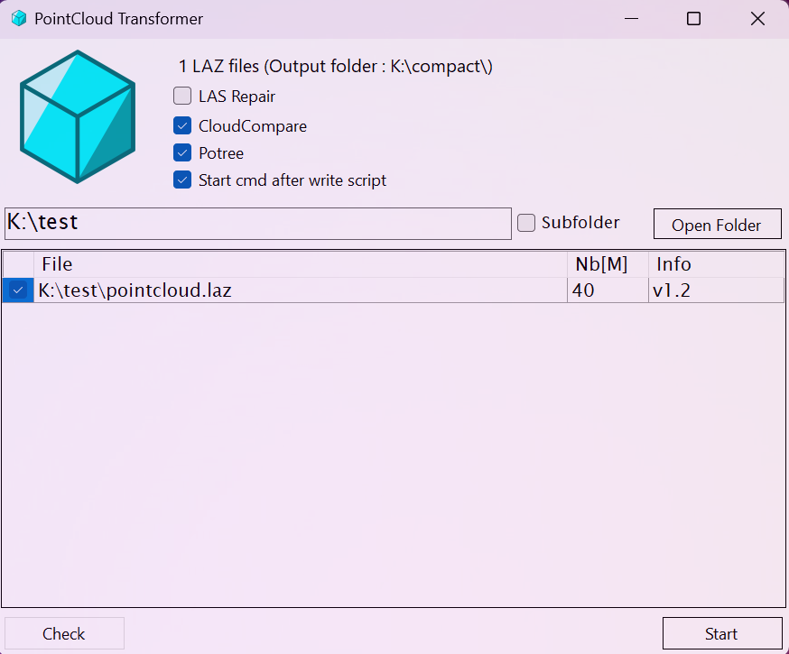

Open Source platform for GIS and BIM.
 
 

# BIMaps Web app

For more infos see the website : [bimaps.io](https://bimaps.io)

 
 

# BIMaps desktop app

## BIMaps-pointcloud

Desktop application for testing and transforming pointclouds.

### Quick guide

#### Start Transformation

1. Click on `Open folder` for load LAZ files
2. Choose the options for export (CloudCompare, Potree)

    if you check `Start cmd` you job start after you click on start, Otherwise the script is created without launching

 

#### Check LAZ files

1. Click on `Open folder` for load LAZ files
2. Click on `Check` (at the bottom left)
3. The status is updated in the `Info` column

    `File reading may take time !`

 

### Installation (Windows 10/11 x64)

1) Download the application [bimaps-pointcloud.zip](https://raw.githubusercontent.com/bimaps/bimaps/main/bimaps-pointcloud/bimaps-pointcloud.zip)

2) Check that no blockage is active.
    - Select the file : right mouse button on the file then `Properties`
    - Check Unblock :

        

3) Unzip the folder and launch the application : `bimaps-pointclouds.exe`

 
 

### Licence

This software is free and delivery without garanties.
Contains following open source applications :
- LasTools (public) : https://lastools.github.io
- Potree Converter : https://github.com/potree/PotreeConverter
